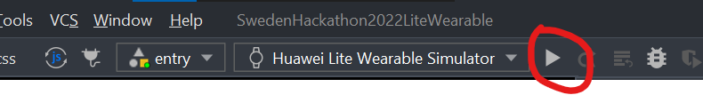
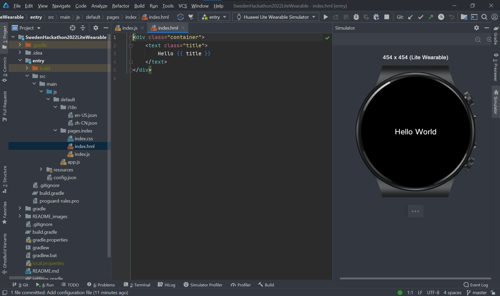

# Sweden Hackathon 2022 - Lite Wearable starter project

## How to run the project

1. Clone this repository
2. Install the latest version of [HUAWEI DevEco Studio](https://developer.harmonyos.com/en/develop/deveco-studio/)
3. On HUAWEI DevEco Studio, click File --> Open, then choose the project directory (which is cloned in step 1)
4. Click the following button to run the app on the emulator

5. After step 4 is done, you should have something similar to the picture below:

## Documentation

Visit the following websites to start learning HUAWEI lite wearable app development
1. [Basic HUAWEI lite wearable app development](https://developer.harmonyos.com/en/docs/documentation/doc-guides/lite-wearable-overview-0000001197577411)
2. [Connect HUAWEI lite wearable app with HUAWEI phone](https://developer.huawei.com/consumer/en/doc/development/connectivity-Guides/integrating-fitnesstwatch-sdk-0000001052859174)
